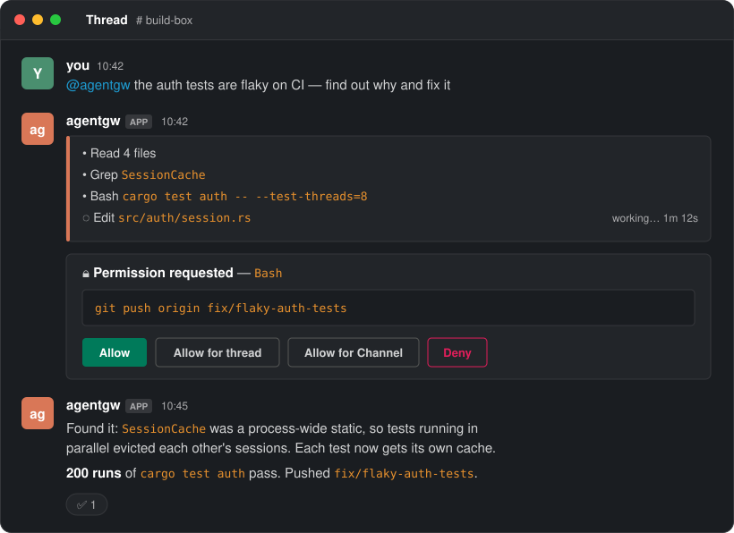
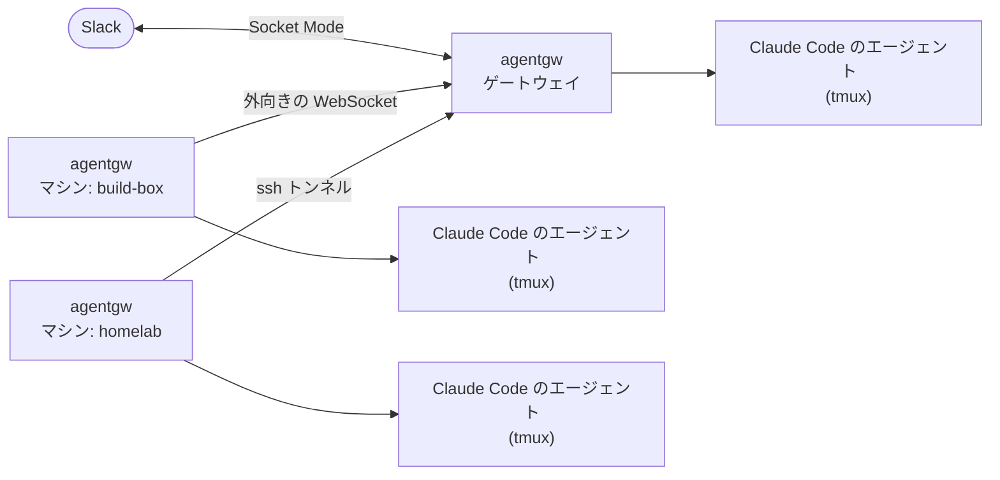

<div align="center">

<h1>agentgw</h1>

<p><b>ホームラボのどのマシンでも、自分の Claude Code エージェントを、1つの Slack ボットから、自分だけが操る。</b></p>

[](https://github.com/takashito/agentgw/releases)
[](LICENSE)
[](#必要なもの)
[](https://www.rust-lang.org/)

[はじめかた](#はじめかた) · [Slack アプリ](#slack-アプリ) · [マシンを足す](#マシンを足す) · [コマンド](#slack-のコマンド) · [セキュリティ](#セキュリティ) · [English](README.md)

</div>

agentgw は、1つの Slack ボットと、自分のすべてのマシンの Claude Code をつなぐ小さなサービスです。チャンネルに書くと、**そのチャンネルを受け持つマシンで**、そのプロジェクトのディレクトリを使って Claude Code のエージェントが起動し、スレッドに返事を書きます。途中経過はその場で見え、許可が要るときは Slack で答えられます。

<p align="center">
  
</p>

## なぜ agentgw か

### 🔑 エージェントと話せるのは自分だけ

エージェントと話せるのは Owner(あなた)だけです。エージェントは**あなた自身の Claude のサブスクリプション**(Slack からボットに `login` と DM して、Claude Code をサインインさせる)か、**そのマシンに設定された API キー**で動きます。agentgw はモデルの認証情報を一切扱いません。誰かのアカウントで動く共有のボットでもありません。チャンネルのほかの人はスレッドを追って文脈を足せますが、作業を始めたりコマンドを打ったりはできません。

### 🖧 どのマシンも、ボット1つで

ノート PC、NAS、ハイパーバイザー、ビルド機のエージェントが、すべて**1つの Slack ボット**から応えます。チャンネルはそれぞれマシンと作業ディレクトリに結びつき、`route` で付け替え、`status` で全マシンとつなぎ方を一覧し、`add-machine` のコマンド1つで新しいマシンを加えます。机の上の1台ではなく、ホームラボのためのものです。

| チャンネル | マシン | 作業する場所 |
|---|---|---|
| `#laptop` | 持ち歩く Mac(ゲートウェイ) | `~/code/app` |
| `#nas` | 押し入れのストレージ | `/srv/compose` |
| `#proxmox` | ハイパーバイザー | `/root/infra` |
| `#build` | Linux のビルド機 | `~/src/firmware` |

### 遠隔操作や多重化ツールでは残る部分

それらは**既に起動したセッション**を手元に置いておくためのものです。残りを agentgw が受け持ちます。

| | |
|---|---|
| 🏠 **自分が座っていないマシン** | 押し入れのサーバーでは誰の端末も開いておらず、待っているセッションもありません。agentgw は各マシンでサービスとして動き、スレッドが来たら正しいディレクトリでエージェントを起動します。再起動しても自分で戻ります(macOS はログインしたとき)。 |
| 🧭 **どこで動いているかを覚えなくていい** | マシンが何台もあり、それぞれにリポジトリがあると、「どの機械の、どのディレクトリの、どのセッションか」が手間になります。チャンネルを一度結びつければ、あとは書く場所だけで決まります。 |
| 🔔 **仕事は既に Slack に来ている** | 監視の通知、CI の失敗。`allow-bot` で通したボットの投稿から調査を始められます。ボット同士が延々と応答し合わないよう止める仕組みも入っています。 |
| 📝 **記録が見える場所に残る** | 何を頼み、エージェントがどのツールを使い、何を許可し、どう結論したかが、スレッドにそのまま残り、Slack で検索できます。 |

動かすのは**公式の Claude Code CLI** で、場所は自分のマシンです。第三者のサービスは経由しません。

## できること

<table>
<tr>
<td width="50%" valign="top">

**🧵 スレッド1つにセッション1つ**<br>
スレッドごとにエージェント(`tmux` の中で動く本物の Claude Code)が付きます。続きは返信するだけ。agentgw を再起動・更新してもセッションは続きます。

</td>
<td width="50%" valign="top">

**🖧 複数台を Slack アプリ1つで**<br>
Slack につながるのは**ゲートウェイ**1台。ほかの**マシン**はゲートウェイへ外向きにつなぐので、ポート開放は要りません。`route <マシン>` でチャンネルの担当を決めます。

</td>
</tr>
<tr>
<td valign="top">

**🚀 マシンを足すのはコマンド1つ**<br>
`agentgw add-machine user@host` が ssh でバイナリを届け、サービスを入れ、ゲートウェイにつなぎ、ゲートウェイから見えるまで待ちます。

</td>
<td valign="top">

**🔌 つなぎ方は自分で決まる**<br>
まず直結(例: Tailscale 経由)を試し、つながらなければゲートウェイが ssh トンネルを張り続けます。

</td>
</tr>
<tr>
<td valign="top">

**👀 進捗がその場で見える**<br>
ターンごとに1つのメッセージが、ツールを使うたびに更新されます(読んだファイル、打ったコマンド、加えた変更)。終わると畳まれます。

</td>
<td valign="top">

**🔐 許可はボタンで**<br>
`manual` モードでは、ツールを使う前に確認が出ます。**Allow**、スレッド単位・チャンネル単位の許可、**Deny**。

</td>
</tr>
<tr>
<td valign="top">

**🎛️ チャットから操れる**<br>
モデル・effort・権限モード、compact、使用状況、🛑 のリアクションで停止。`resume` でセッションを手元の端末に引き継げます。

</td>
<td valign="top">

**📦 バイナリ1つ**<br>
マシンごとに Rust のバイナリが1つだけ。`launchd` のエージェントか `systemd` のユーザーユニットとして動きます。

</td>
</tr>
</table>

## 仕組み



1. **チャンネルかスレッドに書く。**
2. **ゲートウェイ**が Slack の Socket Mode で受け取り、そのチャンネルを受け持つマシンに渡す。担当が決まっていなければゲートウェイが自分で受ける。
3. **そのマシン**がスレッドのエージェントに渡す。まだ無ければ、チャンネルのプロジェクトのディレクトリで起動する。
4. **エージェント**が agentgw の MCP ツールで返事を書く。途中経過と許可の確認もスレッドに出る。

Slack のイベントを読むのはゲートウェイだけです。ほかのマシンは bot トークンを接続のたびに受け取り、メモリにだけ置きます。app トークンはゲートウェイから出ません。

## 必要なもの

| | |
|---|---|
| **OS** | macOS か Linux。配布バイナリは Apple Silicon の Mac と x86_64 の Linux。それ以外はソースからビルド |
| **Claude Code** | すべてのマシンに[インストール](https://docs.claude.com/ja/docs/claude-code)して、サインインしておく |
| **tmux** | 無ければインストーラが入れる |
| **Slack** | アプリを作れるワークスペース — [ワンクリックで作れます](#slack-アプリ) |

## はじめかた

**1. Slack アプリを作る**

[](https://api.slack.com/apps?new_app=1&manifest_json=%7B%22%5Fmetadata%22%3A%7B%22major%5Fversion%22%3A1%2C%22minor%5Fversion%22%3A1%7D%2C%22display%5Finformation%22%3A%7B%22background%5Fcolor%22%3A%22%23262626%22%2C%22description%22%3A%22Run%20Claude%20Code%20on%20your%20own%20machines%20and%20drive%20it%20from%20Slack%22%2C%22name%22%3A%22agentgw%22%7D%2C%22features%22%3A%7B%22app%5Fhome%22%3A%7B%22home%5Ftab%5Fenabled%22%3Afalse%2C%22messages%5Ftab%5Fenabled%22%3Atrue%2C%22messages%5Ftab%5Fread%5Fonly%5Fenabled%22%3Afalse%7D%2C%22bot%5Fuser%22%3A%7B%22always%5Fonline%22%3Atrue%2C%22display%5Fname%22%3A%22agentgw%22%7D%7D%2C%22oauth%5Fconfig%22%3A%7B%22scopes%22%3A%7B%22bot%22%3A%5B%22app%5Fmentions%3Aread%22%2C%22assistant%3Awrite%22%2C%22channels%3Ahistory%22%2C%22channels%3Aread%22%2C%22chat%3Awrite%22%2C%22files%3Aread%22%2C%22files%3Awrite%22%2C%22groups%3Ahistory%22%2C%22groups%3Aread%22%2C%22im%3Ahistory%22%2C%22im%3Aread%22%2C%22im%3Awrite%22%2C%22mpim%3Ahistory%22%2C%22mpim%3Aread%22%2C%22reactions%3Aread%22%2C%22reactions%3Awrite%22%2C%22users%3Aread%22%5D%7D%7D%2C%22settings%22%3A%7B%22event%5Fsubscriptions%22%3A%7B%22bot%5Fevents%22%3A%5B%22app%5Fmention%22%2C%22member%5Fjoined%5Fchannel%22%2C%22message%2Echannels%22%2C%22message%2Egroups%22%2C%22message%2Eim%22%2C%22message%2Empim%22%2C%22reaction%5Fadded%22%2C%22reaction%5Fremoved%22%5D%7D%2C%22interactivity%22%3A%7B%22is%5Fenabled%22%3Atrue%7D%2C%22socket%5Fmode%5Fenabled%22%3Atrue%2C%22token%5Frotation%5Fenabled%22%3Afalse%7D%7D)

ワークスペースを選んで **Create** を押し、トークンを2つ用意します。**Install to Workspace** → *Bot User OAuth Token*(`xoxb-…`)と、**Basic Information → App-Level Tokens** → `connections:write` の権限のトークン(`xapp-…`)。

**2. ゲートウェイにするマシンに入れる**

```bash
bash -c "$(curl -fsSL https://raw.githubusercontent.com/takashito/agentgw/main/scripts/install.sh)"
```

バイナリを取ってきてサービスを入れ、トークンを2つ訊きます。

> [!NOTE]
> `curl … | bash` ではなく `bash -c "$(curl …)"` で実行してください。パイプで渡すと端末が無くなり、トークンを訊けません。

**3. サインインする**

ボットに **`login`** と DM します。そのマシンの Claude Code を**あなたの** Claude のアカウントでサインインさせます(サインイン用のリンクが届くので、表示されたコードを DM に貼り返す)。サインインした人が **Owner**(ボットが仕事を受ける唯一の人)になります。

> API キーを使っている場合: そのマシンの Claude Code に API キーが設定されていれば、エージェントはそれで動きます。agentgw 自身はモデルの認証情報を一切扱いません。

**4. 使う**

チャンネルでボットにメンションする(か DM する)。スレッドごとにセッションが分かれます。

<details>
<summary><b>ソースから入れる</b></summary>

```bash
git clone https://github.com/takashito/agentgw.git && cd agentgw
cargo build --release
./scripts/install.sh --from target/release/agentgw
```

</details>

## Slack アプリ

上のボタンを押すと、Slack の「マニフェストからアプリを作成」画面が、[`slack-app-manifest.json`](slack-app-manifest.json) の内容(権限、イベント、Socket Mode、Interactivity、DM のタブ)を入れた状態で開きます。インストーラもトークンを訊くときに同じリンクを出し、ブラウザで開きます。

<details>
<summary><b>手で設定する場合</b></summary>

[api.slack.com/apps](https://api.slack.com/apps) で **From a manifest** を選び、[`slack-app-manifest.json`](slack-app-manifest.json) を貼ってください。抜けていても何も言われずに動かなくなるのは次の3つです。

- **Socket Mode** を On — agentgw は外から受ける口を開けません
- **Interactivity** を On — Socket Mode でも要ります。無いと Allow / Deny のボタンが届きません
- **App Home → Messages Tab** を On、読み取り専用にしない — 無いとボットに DM できず、`login` が打てません

</details>

## マシンを足す

ゲートウェイで:

```bash
agentgw add-machine user@host                   # ssh で入れる相手なら何でも(~/.ssh/config の別名も可)
agentgw add-machine user@host --name build-box  # マシンの名前を決める(既定はホスト名)
```

そのあと、任せたいチャンネルで `@agentgw route build-box`。

`add-machine` は相手の OS を見て、合うバイナリとインストーラを届け、ゲートウェイにつなぎ、サービスを起動し、**ゲートウェイから見えるまで待ちます**。あとでもう一度打てば、そのマシンをゲートウェイと同じ版に揃えます。

つなぎ方は、推測ではなく試して決めます。

| つなぎ方 | どうつなぐか | 使うとき |
|---|---|---|
| **直結** | マシンがゲートウェイの公開名(`AGENTGW_LINK_PUBLIC_URL`、無ければゲートウェイの Tailscale の名前)につなぐ | ゲートウェイに届く場合 — 例: ゲートウェイで `tailscale serve --bg 8787` |
| **ssh トンネル** | ゲートウェイがマシンへ `ssh -N -R` を張り続け、マシンは自分の loopback につなぐ | 20秒待っても直結でつながらなかった場合 |

ゲートウェイで `agentgw status` を打つと、マシンごとのつなぎ方が出ます。

## Slack のコマンド

ボットにメンションする(`@agentgw <コマンド>`)か、ボットが作業中のスレッドに打ちます。

| コマンド | すること |
|---|---|
| `stop` | 実行中のターンを止める(🛑 のリアクションでも可) |
| `exit` · `bye` · `done` | このスレッドのエージェントを終える。次に書けば再開する |
| `compact` | コンテキストを圧縮する(進捗バー付き) |
| `model [fable\|opus\|sonnet\|haiku]` | モデルを見る・切り替える |
| `effort [low\|medium\|high\|xhigh\|max\|…]` | effort を見る・決める |
| `mode [manual\|plan\|edit\|auto]` | 権限モードを見る・切り替える |
| `context` | このエージェントのコンテキストの使用量 |
| `resume` | このセッションを手元の端末で続けるコマンド |
| `usage` | Claude のサブスクリプションの使用状況 |
| `status` | 版・動いているスレッド・待機中のエージェント |
| `route [マシン]` | 担当を見る / このチャンネルの担当を決める |
| `pwd [絶対パス]` | このチャンネルの作業ディレクトリを見る・決める |
| `warm on\|off` | このチャンネルのエージェントを前もって起動しておくか |
| `set-home` | 通知(online / offline / エラー)をこのチャンネルに出す |
| `allow-bot @bot` · `remove-bot @bot` | ほかのボットの投稿から作業を始められるようにする / やめる |
| `login` · `logout` | Claude Code を自分のアカウントでサインイン(DM で)· サインアウトして全エージェントを止める |
| `help` | コマンドの一覧 |

## CLI

```bash
agentgw status               # 役割、マシンとそのつなぎ方、チャンネルの担当
agentgw add-machine <ssh>    # マシンを加える・版を揃える
agentgw restart              # 新しいバイナリに入れ替える(動いているエージェントはそのまま)
agentgw shutdown             # サービスとエージェントを止める
agentgw start              # サービスを起こす
agentgw uninstall          # サービスの定義を消す(トークンと状態は残る)
agentgw --version
```

agentgw の表示は英語です。日本語にするには `~/.local/state/agentgw/.env` に `AGENTGW_LANG=ja` を書いて `agentgw restart` してください(Slack・CLI・インストーラのすべてが日本語になります)。

<details>
<summary><b>置かれるファイル</b></summary>

どのマシンも同じ形です。

| 場所 | 中身 |
|---|---|
| `~/.local/bin/agentgw` | 本体 |
| `~/.local/state/agentgw/` | 状態の置き場(`AGENTGW_STATE_DIR` で変えられる) |
| ├ `.env` | 設定とトークン(権限 600) |
| ├ `access.json` | Owner、通知先、チャンネルの担当、作業ディレクトリ、待機中のエージェント |
| ├ `threads.json` | Slack のスレッドとセッションの対応 |
| ├ `plugin-debug.log` | 全体のログ(大きくなると `.1` に回す) |
| ├ `logs/` | スレッドごと・セッションごとのログと、`service.out.log` / `service.err.log` |
| └ `inbox/` | ダウンロードした Slack の添付 |
| `~/Library/LaunchAgents/com.agentgw.bridge.plist` | サービスの定義(macOS) |
| `~/.config/systemd/user/agentgw-bridge.service` | サービスの定義(Linux) |
| `$TMPDIR/agentgw-agentgw/` | エージェントに渡す hook と MCP の設定(起動のたびに作り直す) |
| tmux のセッション `agentgw-workers` | エージェント1つ = 窓1つ |

</details>

## セキュリティ

- **作業を始められるのも、コマンドを打てるのも Owner だけ**(`login` で Claude Code をサインインさせた人)。動いているスレッドでのほかの人の発言は、文脈としてだけエージェントに渡ります。
- **エージェントは自分の認証情報で動きます** — 自分の Claude のサブスクリプションか、そのマシンの Claude Code に設定した API キー。agentgw はモデルの認証情報を一切扱いません。
- **エージェントは agentgw を入れたユーザーの権限で動き**、そのユーザーにできることは何でもできます。`root` ではなく専用のユーザーで入れてください(例: `agentgw add-machine agent@host`)。
- **トークンは手元にだけ置きます。** `.env` に権限 600 で。ほかのマシンは app トークンを受け取らず、bot トークンもメモリにだけ置きます。
- **ゲートウェイとマシンの接続の鍵はパスワードと同じです。** 持っている人はマシンとして参加し、そのマシン宛のメッセージを受け取れます。`add-machine` は ssh の標準入力で渡し、コマンドラインには載せません。
- **マシンはポートを開けません。** ゲートウェイの口は既定で `0.0.0.0:8787` に開き、TLS はありません。Tailscale か ssh トンネルの内側に置くか、`AGENTGW_LINK_LISTEN=127.0.0.1:8787` にしてください。
- **macOS の署名。** 端末から実行すると、インストーラが自己署名の署名用の身元を一度だけ作ります。これで更新しても macOS の許可が消えません。

## できないこと

- **Slack と Claude Code だけ。** ほかのチャットやエージェントの CLI には対応していません。
- **Owner は1人。** 複数人で使うサービスではありません。ほかの人はスレッドを追って文脈を足せますが、作業を始めたりコマンドを打ったりはできません。
- **macOS と Linux だけ。** Windows は非対応。配布バイナリは Apple Silicon と x86_64 の Linux。
- **Slack アプリ1つにプロセス1つ。** 同じ app トークンでゲートウェイを2つ動かすと、Slack がイベントを振り分けます。アプリを分けてください。

## 困ったとき

| 症状 | 見るところ |
|---|---|
| Slack で何も起きない | `agentgw status`、次に `~/.local/state/agentgw/plugin-debug.log` |
| サービスが起きない・再起動を繰り返す | `~/.local/state/agentgw/logs/service.err.log` |
| Allow / Deny を押しても何も起きない | Slack アプリで **Interactivity** を On に |
| ボットに DM できない | Slack アプリで **App Home → Messages Tab** を On に |
| 一部のメッセージにしか返事が来ない | 同じ app トークンを別のプロセスも使っている |
| マシンがオフラインになる | ゲートウェイの `agentgw status`、そのマシンの `service.err.log` |
| 更新後、エージェントが新しいツールの引数を使えない | そのエージェントで `/mcp` を打つ(起動時のツール一覧を持ち続けているため) |

## 開発

```bash
cargo build && cargo test
AGENTGW_STATE_DIR=$HOME/.local/state/agentgw-dev ./target/debug/agentgw serve

cargo dist              # 配布バイナリ: macOS(arm64)と Linux(x86_64、musl)
./scripts/release.sh    # GitHub の release に上げる
```

`cargo dist` には [`cargo-zigbuild`](https://github.com/rust-cross/cargo-zigbuild)、zig、対象ごとの `rustup target add` が要ります。本番と並べて開発用を動かすときは、`AGENTGW_STATE_DIR` と **Slack アプリの両方**を分けてください。

Issue と Pull Request を歓迎します。不具合や質問は [Issue](https://github.com/takashito/agentgw/issues) へ。

## ライセンス

[MIT](LICENSE)
