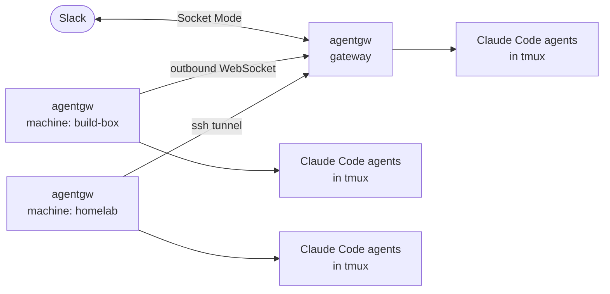

<div align="center">

<h1>agentgw</h1>

<p><b>Slack as the front end for Claude Code on every machine you own — no terminals, no multiplexer to juggle.</b></p>

[](https://github.com/takashito/agentgw/releases)
[](LICENSE)
[](#requirements)
[](https://www.rust-lang.org/)

[Quick start](#quick-start) · [Slack app](#slack-app-setup) · [Adding machines](#adding-machines) · [Commands](#slack-commands) · [Security](#security) · [日本語](README.ja.md)

</div>

agentgw is a small service that connects one Slack bot to Claude Code on every machine you own. Post in a channel and a Claude Code agent starts **on the machine that channel belongs to**, in that project's directory, and answers in the thread — showing its progress as it goes and asking for your approval in Slack when it needs it.

<p align="center">
  
</p>

## Why agentgw?

agentgw drives the **official Claude Code CLI** on your own machines. Compared with Claude Code's own Remote Control, it adds:

### 🚀 Start a session on any machine, any time

Post in Slack and a new Claude Code session starts on the machine that handles the channel. Nothing has to be running there beforehand — no `claude remote-control` left open per project. agentgw runs as a service on every connected machine.

### ↩️ Pick up any past session

When an agent has gone quiet and been put away, reply in its thread: the same conversation resumes on the same machine, whenever you come back to it.

### 🔎 Every session, searchable and linkable

Every session on every machine lives in one Slack workspace. Find past work across all of them with Slack search, and hand another session's result to the agent you're talking to by pasting the thread or message link — even when it ran on a different machine.

### 💬 Slack is the interface

One place for every agent on every machine, so there's no juggling terminals with cmux or herdr. Interrupt an agent with a 🛑 reaction, edit a message to revise the request or delete it to take it back, and send files either way.

### ⚡ Agents that are ready, and tidy up after themselves

A warm agent waits for each project, so a new thread gets an answer right away. Agents that sit idle are put away on their own.

## Features

<table>
<tr>
<td width="50%" valign="top">

**🧵 One thread, one session**<br>
Each thread gets its own agent — a real Claude Code session in `tmux`. Reply to continue; sessions survive restarts and upgrades of agentgw.

</td>
<td width="50%" valign="top">

**🖧 A fleet, one Slack app**<br>
One **gateway** holds the Slack connection. Your other **machines** dial out to it, so they need no open ports. `route <machine>:<path>` hands a channel to a machine and picks the folder it works in.

</td>
</tr>
<tr>
<td valign="top">

**🚀 Add a machine in one command**<br>
`agentgw add-machine user@host` ships the binary over ssh, installs the service, connects it, and waits until the gateway sees it.

</td>
<td valign="top">

**🔌 Links that pick themselves**<br>
Tries a direct connection (e.g. over Tailscale) first; if that doesn't come up, the gateway keeps an ssh tunnel open instead.

</td>
</tr>
<tr>
<td valign="top">

**👀 Live progress**<br>
One message per turn, updated as tools run — files read, commands run, edits made — and folded away when the turn ends.

</td>
<td valign="top">

**🔐 Approvals as buttons**<br>
In `manual` mode each tool call asks first, with **Allow** and **Deny** buttons in the thread.

</td>
</tr>
<tr>
<td valign="top">

**🎛️ Control from chat**<br>
Model, effort and permission mode; compact; usage; stop with a 🛑 reaction; `resume` hands the session to your local terminal.

</td>
<td valign="top">

**📦 One static binary**<br>
A single Rust binary per machine, running as a `launchd` agent or a `systemd` user unit. Nothing else to install or babysit.

</td>
</tr>
<tr>
<td valign="top">

**🔔 Bots can start work**<br>
Let a bot's messages through with `allow-bot`, and an alert from monitoring or CI can start an investigation — with a guard against two bots answering each other forever.

</td>
<td valign="top">

**🔑 Sign-in per machine**<br>
Each machine checks its own Claude Code sign-in and tells you when it lapses; send `login` in a channel that machine handles to sign in again.

</td>
</tr>
</table>

## How it works



1. **You post** in a channel or thread.
2. **The gateway** receives it over Slack Socket Mode and passes it to the machine that owns the channel — or keeps it, if the channel has no owner.
3. **That machine** hands it to the thread's agent, starting one in the channel's project directory if needed.
4. **The agent** replies through agentgw's MCP tools, with progress and permission prompts along the way.

Only the gateway reads Slack's event stream. Other machines get the bot token over the link and keep it in memory only; the app token never leaves the gateway.

## Requirements

| | |
|---|---|
| **OS** | macOS or Linux. Prebuilt binaries: Apple Silicon Mac, x86_64 Linux. Other targets build from source. |
| **Claude Code** | [Installed](https://docs.claude.com/en/docs/claude-code) and signed in on every machine |
| **tmux** | Installed by the installer if missing |
| **Slack** | A workspace where you can create an app — [one click](#slack-app-setup) |

## Quick start

**1. Create the Slack app**

[](https://api.slack.com/apps?new_app=1&manifest_json=%7B%22%5Fmetadata%22%3A%7B%22major%5Fversion%22%3A1%2C%22minor%5Fversion%22%3A1%7D%2C%22display%5Finformation%22%3A%7B%22background%5Fcolor%22%3A%22%23262626%22%2C%22description%22%3A%22Run%20Claude%20Code%20on%20your%20own%20machines%20and%20drive%20it%20from%20Slack%22%2C%22name%22%3A%22agentgw%22%7D%2C%22features%22%3A%7B%22agent%5Fview%22%3A%7B%22agent%5Fdescription%22%3A%22Run%20Claude%20Code%20on%20your%20own%20machines%20and%20drive%20it%20from%20Slack%22%7D%2C%22app%5Fhome%22%3A%7B%22home%5Ftab%5Fenabled%22%3Afalse%2C%22messages%5Ftab%5Fenabled%22%3Atrue%2C%22messages%5Ftab%5Fread%5Fonly%5Fenabled%22%3Afalse%7D%2C%22bot%5Fuser%22%3A%7B%22always%5Fonline%22%3Atrue%2C%22display%5Fname%22%3A%22agentgw%22%7D%7D%2C%22oauth%5Fconfig%22%3A%7B%22scopes%22%3A%7B%22bot%22%3A%5B%22app%5Fmentions%3Aread%22%2C%22assistant%3Awrite%22%2C%22channels%3Ahistory%22%2C%22channels%3Aread%22%2C%22chat%3Awrite%22%2C%22files%3Aread%22%2C%22files%3Awrite%22%2C%22groups%3Ahistory%22%2C%22groups%3Aread%22%2C%22im%3Ahistory%22%2C%22im%3Aread%22%2C%22im%3Awrite%22%2C%22mpim%3Ahistory%22%2C%22mpim%3Aread%22%2C%22reactions%3Aread%22%2C%22reactions%3Awrite%22%2C%22users%3Aread%22%5D%7D%7D%2C%22settings%22%3A%7B%22event%5Fsubscriptions%22%3A%7B%22bot%5Fevents%22%3A%5B%22agent%5Fsession%5Fstopped%22%2C%22agent%5Fsession%5Ftitle%5Fchanged%22%2C%22app%5Fmention%22%2C%22app%5Fhome%5Fopened%22%2C%22member%5Fjoined%5Fchannel%22%2C%22message%2Echannels%22%2C%22message%2Egroups%22%2C%22message%2Eim%22%2C%22message%2Empim%22%2C%22reaction%5Fadded%22%2C%22reaction%5Fremoved%22%5D%7D%2C%22interactivity%22%3A%7B%22is%5Fenabled%22%3Atrue%7D%2C%22socket%5Fmode%5Fenabled%22%3Atrue%2C%22token%5Frotation%5Fenabled%22%3Afalse%7D%7D)

Pick a workspace and click **Create**, then collect two tokens: **Install to Workspace** → *Bot User OAuth Token* (`xoxb-…`), and **Basic Information → App-Level Tokens** → a token with `connections:write` (`xapp-…`).

**2. Install on the gateway machine**

Pick a machine that stays on — a home server, a NAS or a small VM. Everything goes through the gateway, so when it sleeps every machine goes quiet. A laptop you carry around works better as one of the machines: it drops off when it sleeps and comes back when it wakes, without affecting the others.

```bash
bash -c "$(curl -fsSL https://raw.githubusercontent.com/takashito/agentgw/main/scripts/install.sh)"
```

It downloads the binary, installs the service, and asks for the two tokens.

> [!NOTE]
> Use `bash -c "$(curl …)"`, not `curl … | bash` — piping takes the terminal away, and the installer can't ask for your tokens.

**3. Sign in**

DM the bot **`login`**. It signs Claude Code on that machine in to **your** Claude account — you get a sign-in link, and paste the code back into the DM. The person who signs in becomes the **owner**, the only person the bot works for.

> Already use an API key? If Claude Code on the machine is set up with one, agents use it. agentgw itself never sees model credentials.

**4. Use it**

Mention the bot in a channel (or DM it). Every thread is its own session.

<details>
<summary><b>Build from source</b></summary>

```bash
git clone https://github.com/takashito/agentgw.git && cd agentgw
cargo build --release
./scripts/install.sh --from target/release/agentgw
```

</details>

## Slack app setup

The button above opens Slack's *Create an app from a manifest* page with [`slack-app-manifest.json`](slack-app-manifest.json) filled in: scopes, events, Socket Mode, Interactivity and the DM tab. The installer shows the same link (and opens it) when it asks for your tokens.

<details>
<summary><b>Setting the app up by hand</b></summary>

Create an app **From a manifest** at [api.slack.com/apps](https://api.slack.com/apps) and paste [`slack-app-manifest.json`](slack-app-manifest.json). These fail silently when they're missing:

- **Socket Mode** on — agentgw never opens a public endpoint.
- **Interactivity** on, even with Socket Mode — otherwise the Allow / Deny buttons never arrive.
- **App Home → Messages Tab** on and not read-only — otherwise nobody can DM the bot, and `login` is a DM.

</details>

## Adding machines

From the gateway:

```bash
agentgw add-machine user@host                   # any ssh destination, ~/.ssh/config aliases included
agentgw add-machine user@host --name build-box  # name the machine (default: its hostname)
agentgw add-machine user@host -i ~/.ssh/id_ed25519  # the key to offer
agentgw add-machine user@host -p                # let ssh ask for a password (once)
agentgw add-machine user@host -n                # measure the route again instead of reusing the last one
```

Then hand it a channel — in that channel: `@agentgw pwd build-box:~/dev/app`.

`add-machine` checks the remote OS, sends the matching binary and the installer, links the machine, starts the service and **watches until the link comes up** (the machine's own log and the gateway's view, either one). Run it again later to bring that machine to the gateway's version.

The link is chosen by measuring, not guessing. Every candidate is asked at once, **from the machine**,
and the question is whether the gateway itself answers there — `/status` says `unauthorized` without a
token, which nothing else does. An address the gateway doesn't listen on yet is opened for the length of
the question, and for good once that route is chosen.

| Link | How | Used when |
|---|---|---|
| **Direct** | The machine dials the gateway — its Tailscale name, its LAN address, or `AGENTGW_LINK_PUBLIC_URL` if you set one | The gateway answered there when the machine asked |
| **SSH tunnel** | The gateway keeps `ssh -N -R` open to the machine, which dials its own loopback | Nothing direct answered |

When more than one works you are asked which; one is taken without asking. **Measuring says who answers,
and only a real link says a route works**, so what is measured is an order: each is set up and watched in
turn until one carries the link, with the ssh tunnel last. The one that worked is remembered on the
gateway, so the next `add-machine` starts there — `-n` measures again.

`install` never asks where to listen: a gateway starts on loopback alone, and `add-machine` opens the one
address a machine turns out to need.

`agentgw status` on the gateway lists each machine and how it is connected, and `machines` in Slack shows
where each one is reachable.

## Slack commands

Mention the bot (`@agentgw <command>`), or type in a thread it's working in.

| Command | What it does |
|---|---|
| `stop` | Stop the current turn (a 🛑 reaction works too) |
| `exit` · `bye` · `done` | End this thread's agent; your next message resumes it |
| `compact` | Compact the context, with a progress bar |
| `model [fable\|opus\|sonnet\|haiku]` | Show or switch the model |
| `effort [low\|medium\|high\|xhigh\|max\|…]` | Show or set the effort level |
| `mode [manual\|plan\|edit\|auto]` | Show or switch the permission mode |
| `context` | This agent's context usage |
| `resume` | The command to continue this session in your own terminal |
| `usage` | Your Claude subscription usage |
| `status` | Version, active threads and warm agents |
| `channels` | Which machine handles this channel and the others |
| `machines` | The gateway and every machine: how each one links, and the address it links from |
| `pwd` | Show where this thread works |
| `cd <path>` · `cd <machine>[:<path>]` | Move **this thread** to that folder, or to that machine — conversation and all |
| `route <path>` · `route <machine>[:<path>]` | Set **this channel's** folder and machine, which decides where the threads it starts next begin |
| `warm on\|off` | Keep an agent started ahead of time for this channel |
| `set-home` | Send notices (online, offline, errors) to this channel |
| `allow-bot @bot` · `remove-bot @bot` | Let another bot's messages start work |
| `login` · `logout` | Sign Claude Code in to your account (by DM) · sign out and stop all agents |
| `help` | All commands |

## CLI

```bash
agentgw status               # role, machines and how they connect, channel routing
agentgw add-machine <ssh>    # add or upgrade a machine
agentgw restart              # swap in a new binary; running agents keep going
agentgw shutdown             # stop the service and its agents
agentgw start                # start the service
agentgw uninstall            # remove the service definition (tokens and state are kept)
agentgw --version
```

agentgw speaks English. For Japanese — in Slack, the CLI and the installer — add `AGENTGW_LANG=ja` to `~/.local/state/agentgw/.env` and run `agentgw restart`.

<details>
<summary><b>Files on disk</b></summary>

Every machine uses the same layout.

| Path | What |
|---|---|
| `~/.local/bin/agentgw` | The binary |
| `~/.local/state/agentgw/` | State — override with `AGENTGW_STATE_DIR` |
| ├ `.env` | Settings and tokens (mode 600) |
| ├ `access.json` | Owner, notice channel, routing, project directories, warm agents |
| ├ `threads.json` | Which Slack thread belongs to which session |
| ├ `plugin-debug.log` | Main log (rotated to `.1`) |
| ├ `logs/` | Per-thread and per-session logs, plus `service.out.log` / `service.err.log` |
| └ `inbox/` | Downloaded Slack attachments |
| `~/Library/LaunchAgents/com.agentgw.bridge.plist` | Service definition (macOS) |
| `~/.config/systemd/user/agentgw-bridge.service` | Service definition (Linux) |
| `$TMPDIR/agentgw-agentgw/` | Hook and MCP config handed to agents (regenerated on start) |
| tmux session `agentgw-workers` | One window per agent |

</details>

## Security

- **Only the owner can start work or run commands** — the person who first signed Claude Code in with `login`. In a thread that's already running, other people's messages reach the agent as context only. agentgw is not a shared bot running on somebody else's account.
- **Agents run on your own credentials** — your Claude subscription, or an API key set up for Claude Code on that machine. agentgw never handles model credentials: signing in goes through Claude Code's own sign-in flow. Each machine keeps its own sign-in; if one lapses, send `login` in a channel that machine handles.
- **Agents run as the user that installed agentgw** and can do anything that user can. Install under a dedicated account (e.g. `agentgw add-machine agent@host`) rather than `root`.
- **Tokens stay local**, in `.env` with mode 600. Other machines never get the app token; they hold the bot token in memory only.
- **The link secret is a password.** Whoever has it can join as a machine and receive that machine's messages. `add-machine` sends it over ssh stdin, never on a command line.
- **Tool calls can ask first.** In `manual` mode each call waits for you in Slack; approve it once, for the rest of the thread, or for the channel, or deny it.
- **Machines open no ports.** The gateway listens on `127.0.0.1:8787` only; `add-machine` opens the one address a machine turns out to need (its LAN or tailnet address, never `0.0.0.0`). There is no TLS on those, so keep them behind your network, Tailscale, or an ssh tunnel.
- **macOS signing.** Run from a terminal, the installer creates a self-signed code-signing identity once, so macOS permission grants survive upgrades.

## Limitations

- **Slack and Claude Code only.** No other chat platforms or agent CLIs.
- **One owner per install.** It isn't a multi-user service: other people can follow a thread and add context, but can't start work or run commands.
- **macOS and Linux only.** No Windows. Prebuilt binaries cover Apple Silicon and x86_64 Linux.
- **One process per Slack app.** Two agentgw gateways on the same app token split Slack's events between them — give each its own app.

## Troubleshooting

| Symptom | Where to look |
|---|---|
| Nothing happens in Slack | `agentgw status`, then `~/.local/state/agentgw/plugin-debug.log` |
| The service won't start or keeps restarting | `~/.local/state/agentgw/logs/service.err.log` |
| Allow / Deny buttons do nothing | Turn on **Interactivity** in the Slack app |
| You can't DM the bot | Turn on **App Home → Messages Tab** in the Slack app |
| Only some messages get answered | Another process is using the same app token |
| A machine shows as offline | `agentgw status` on the gateway; `service.err.log` on that machine |
| An agent can't use new tool options after an upgrade | Run `/mcp` in that agent — it keeps the tool list it started with |
| "This shell can't reach your systemd user session" | Your Linux user has no running systemd instance to talk to: `loginctl enable-linger $USER`, then log in again |

## Development

```bash
cargo build && cargo test
AGENTGW_STATE_DIR=$HOME/.local/state/agentgw-dev ./target/debug/agentgw serve

cargo dist              # release binaries: macOS (arm64) and Linux (x86_64, musl)
./scripts/release.sh    # upload them as a GitHub release
```

`cargo dist` needs [`cargo-zigbuild`](https://github.com/rust-cross/cargo-zigbuild), zig, and `rustup target add` for each target. For a development instance next to a real one, use a separate `AGENTGW_STATE_DIR` **and a separate Slack app**.

Issues and pull requests are welcome — [open an issue](https://github.com/takashito/agentgw/issues) for bugs and questions.

## License

[MIT](LICENSE)
