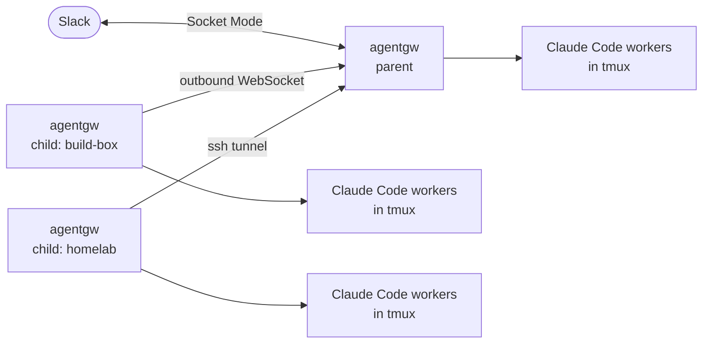

<div align="center">

<h1>agentgw</h1>

<p><b>Run Claude Code on the machines you own — and drive every one of them from Slack.</b></p>

[](https://github.com/takashito/agentgw/releases)
[](LICENSE)
[](#requirements)
[](https://www.rust-lang.org/)

[Quick start](#quick-start) · [Slack app](#slack-app-setup) · [Adding machines](#adding-machines) · [Commands](#slack-commands) · [Security](#security) · [日本語](README.ja.md)

</div>

agentgw is a small service that connects a Slack workspace to Claude Code sessions on your own machines. Post in a channel and a Claude Code worker starts **on the machine that channel belongs to**, in that project's directory, and answers in the thread — showing its progress as it goes and asking for your approval in Slack when it needs it.

<p align="center">
  
</p>

## Why agentgw?

Remote control and terminal multiplexers keep a session you **already started** within reach. agentgw is for what they leave to you:

| | |
|---|---|
| 🏠 **Machines you don't sit at** | The home server, the build box, the hypervisor. No terminal is open there, so nothing is waiting for you. agentgw runs as a service on each one and starts a worker — in the right directory — when a thread arrives. It starts again on its own after a reboot (on macOS, once you log in). |
| 🧭 **Not having to remember where things run** | With several machines and several repos on each, the friction is *which box, which directory, which session*. Map a channel to a machine and a directory once; after that, where you post is all that decides. |
| 🔔 **Work that already arrives in Slack** | Alerts from monitoring, failures from CI, requests from people. Let a bot's messages through with `allow-bot`, and its alert can start an investigation — with a guard against two bots answering each other forever. |
| 📝 **A record where people look** | The request, every tool the agent ran, what you approved and what it concluded stay in the thread, searchable in Slack. |

It drives the **official Claude Code CLI**, on your hardware, with your subscription. Nothing is proxied through a third-party service.

## Features

<table>
<tr>
<td width="50%" valign="top">

**🧵 One thread, one session**<br>
Each thread gets its own worker — a real Claude Code session in `tmux`. Reply to continue; sessions survive restarts and upgrades of agentgw.

</td>
<td width="50%" valign="top">

**🖧 A fleet, one Slack app**<br>
One **parent** holds the Slack connection. **Children** dial out to it, so they need no open ports. `route <machine>` assigns a channel.

</td>
</tr>
<tr>
<td valign="top">

**🚀 Add a machine in one command**<br>
`agentgw add-child user@host` ships the binary over ssh, installs the service, links it, and waits until the parent sees it.

</td>
<td valign="top">

**🔌 Links that pick themselves**<br>
Tries a direct connection (e.g. over Tailscale) first; if that doesn't come up, the parent keeps an ssh tunnel open instead.

</td>
</tr>
<tr>
<td valign="top">

**👀 Live progress**<br>
One message per turn, updated as tools run — files read, commands run, edits made — and folded away when the turn ends.

</td>
<td valign="top">

**🔐 Approvals as buttons**<br>
In `manual` mode each tool call asks first: **Allow**, allow for the thread or the channel, or **Deny**.

</td>
</tr>
<tr>
<td valign="top">

**🎛️ Control from chat**<br>
Model, effort and permission mode; compact; usage; stop with a 🛑 reaction; `resume` hands the session to your local terminal.

</td>
<td valign="top">

**📦 One static binary**<br>
A single Rust binary per machine, running as a `launchd` agent or a `systemd` user unit. Nothing else to install or babysit.

</td>
</tr>
</table>

## How it works



1. **You post** in a channel or thread.
2. **The parent** receives it over Slack Socket Mode and passes it to the machine that owns the channel — or keeps it, if the channel has no owner.
3. **That machine** hands it to the thread's worker, starting one in the channel's project directory if needed.
4. **The worker** replies through agentgw's MCP tools, with progress and permission prompts along the way.

Only the parent reads Slack's event stream. Children get the bot token over the link and keep it in memory only; the app token never leaves the parent.

## Requirements

| | |
|---|---|
| **OS** | macOS or Linux. Prebuilt binaries: Apple Silicon Mac, x86_64 Linux. Other targets build from source. |
| **Claude Code** | [Installed](https://docs.claude.com/en/docs/claude-code) and signed in on every machine |
| **tmux** | Installed by the installer if missing |
| **Slack** | A workspace where you can create an app — [one click](#slack-app-setup) |

## Quick start

**1. Create the Slack app**

[](https://api.slack.com/apps?new_app=1&manifest_json=%7B%22%5Fmetadata%22%3A%7B%22major%5Fversion%22%3A1%2C%22minor%5Fversion%22%3A1%7D%2C%22display%5Finformation%22%3A%7B%22background%5Fcolor%22%3A%22%23262626%22%2C%22description%22%3A%22Run%20Claude%20Code%20on%20your%20own%20machines%20and%20drive%20it%20from%20Slack%22%2C%22name%22%3A%22agentgw%22%7D%2C%22features%22%3A%7B%22app%5Fhome%22%3A%7B%22home%5Ftab%5Fenabled%22%3Afalse%2C%22messages%5Ftab%5Fenabled%22%3Atrue%2C%22messages%5Ftab%5Fread%5Fonly%5Fenabled%22%3Afalse%7D%2C%22bot%5Fuser%22%3A%7B%22always%5Fonline%22%3Atrue%2C%22display%5Fname%22%3A%22agentgw%22%7D%7D%2C%22oauth%5Fconfig%22%3A%7B%22scopes%22%3A%7B%22bot%22%3A%5B%22app%5Fmentions%3Aread%22%2C%22assistant%3Awrite%22%2C%22channels%3Ahistory%22%2C%22channels%3Aread%22%2C%22chat%3Awrite%22%2C%22files%3Aread%22%2C%22files%3Awrite%22%2C%22groups%3Ahistory%22%2C%22groups%3Aread%22%2C%22im%3Ahistory%22%2C%22im%3Aread%22%2C%22im%3Awrite%22%2C%22mpim%3Ahistory%22%2C%22mpim%3Aread%22%2C%22reactions%3Aread%22%2C%22reactions%3Awrite%22%2C%22users%3Aread%22%5D%7D%7D%2C%22settings%22%3A%7B%22event%5Fsubscriptions%22%3A%7B%22bot%5Fevents%22%3A%5B%22app%5Fmention%22%2C%22member%5Fjoined%5Fchannel%22%2C%22message%2Echannels%22%2C%22message%2Egroups%22%2C%22message%2Eim%22%2C%22message%2Empim%22%2C%22reaction%5Fadded%22%2C%22reaction%5Fremoved%22%5D%7D%2C%22interactivity%22%3A%7B%22is%5Fenabled%22%3Atrue%7D%2C%22socket%5Fmode%5Fenabled%22%3Atrue%2C%22token%5Frotation%5Fenabled%22%3Afalse%7D%7D)

Pick a workspace and click **Create**, then collect two tokens: **Install to Workspace** → *Bot User OAuth Token* (`xoxb-…`), and **Basic Information → App-Level Tokens** → a token with `connections:write` (`xapp-…`).

**2. Install on the parent machine**

```bash
bash -c "$(curl -fsSL https://raw.githubusercontent.com/takashito/agentgw/main/scripts/install.sh)"
```

It downloads the binary, installs the service, and asks for the two tokens.

> [!NOTE]
> Use `bash -c "$(curl …)"`, not `curl … | bash` — piping takes the terminal away, and the installer can't ask for your tokens.

**3. Sign in**

DM the bot **`login`**. The first person to do so becomes the **owner**, the only person it takes commands from.

**4. Use it**

Mention the bot in a channel (or DM it). Every thread is its own session.

<details>
<summary><b>Build from source</b></summary>

```bash
git clone https://github.com/takashito/agentgw.git && cd agentgw
cargo build --release
./scripts/install.sh --from target/release/agentgw
```

</details>

## Slack app setup

The button above opens Slack's *Create an app from a manifest* page with [`slack-app-manifest.json`](slack-app-manifest.json) filled in: scopes, events, Socket Mode, Interactivity and the DM tab. The installer shows the same link (and opens it) when it asks for your tokens.

<details>
<summary><b>Setting the app up by hand</b></summary>

Create an app **From a manifest** at [api.slack.com/apps](https://api.slack.com/apps) and paste [`slack-app-manifest.json`](slack-app-manifest.json). These fail silently when they're missing:

- **Socket Mode** on — agentgw never opens a public endpoint.
- **Interactivity** on, even with Socket Mode — otherwise the Allow / Deny buttons never arrive.
- **App Home → Messages Tab** on and not read-only — otherwise nobody can DM the bot, and `login` is a DM.

</details>

## Adding machines

From the parent:

```bash
agentgw add-child user@host                   # any ssh destination, ~/.ssh/config aliases included
agentgw add-child user@host --name build-box  # name the machine (default: its hostname)
```

Then assign channels to it — in the channel: `@agentgw route build-box`.

`add-child` checks the remote OS, sends the matching binary and the installer, links the machine, starts the service and **waits until the parent sees it**. Run it again later to bring that machine to the parent's version.

The link is chosen by trying, not guessing:

| Link | How | Used when |
|---|---|---|
| **Direct** | The child dials the parent's public name (`AGENTGW_LINK_PUBLIC_URL`, or its Tailscale name) | The parent is reachable — e.g. `tailscale serve --bg 8787` on the parent |
| **SSH tunnel** | The parent keeps `ssh -N -R` open to the child, which dials its own loopback | Direct didn't connect within 20 seconds |

`agentgw status` on the parent lists each child and its link.

## Slack commands

Mention the bot (`@agentgw <command>`), or type in a thread it's working in.

| Command | What it does |
|---|---|
| `stop` | Stop the current turn (a 🛑 reaction works too) |
| `exit` · `bye` · `done` | End this thread's worker; your next message resumes it |
| `compact` | Compact the context, with a progress bar |
| `model [fable\|opus\|sonnet\|haiku]` | Show or switch the model |
| `effort [low\|medium\|high\|xhigh\|max\|…]` | Show or set the effort level |
| `mode [manual\|plan\|edit\|auto]` | Show or switch the permission mode |
| `context` | This worker's context usage |
| `resume` | The command to continue this session in your own terminal |
| `usage` | Your Claude subscription usage |
| `status` | Version, active threads and warm workers |
| `route [machine]` | Show routing, or assign this channel to a machine |
| `pwd [absolute path]` | Show or set this channel's project directory |
| `warm on\|off` | Keep a worker pre-started for this channel |
| `set-home` | Send notices (online, offline, errors) to this channel |
| `allow-bot @bot` · `remove-bot @bot` | Let another bot's messages start work |
| `login` · `logout` | Sign in (by DM) · sign out and stop all workers |
| `help` | All commands |

## CLI

```bash
agentgw status             # role, children and their links, channel routing
agentgw add-child <ssh>    # add or upgrade a machine
agentgw restart            # swap in a new binary; running workers keep going
agentgw shutdown           # stop the service and its workers
agentgw start              # start the service
agentgw uninstall          # remove the service definition (tokens and state are kept)
agentgw --version
```

<details>
<summary><b>Files on disk</b></summary>

Every machine uses the same layout.

| Path | What |
|---|---|
| `~/.local/bin/agentgw` | The binary |
| `~/.local/state/agentgw/` | State — override with `AGENTGW_STATE_DIR` |
| ├ `.env` | Settings and tokens (mode 600) |
| ├ `access.json` | Owner, notice channel, routing, project directories, warm workers |
| ├ `threads.json` | Which Slack thread belongs to which session |
| ├ `plugin-debug.log` | Main log (rotated to `.1`) |
| ├ `logs/` | Per-thread and per-session logs, plus `service.out.log` / `service.err.log` |
| └ `inbox/` | Downloaded Slack attachments |
| `~/Library/LaunchAgents/com.agentgw.bridge.plist` | Service definition (macOS) |
| `~/.config/systemd/user/agentgw-bridge.service` | Service definition (Linux) |
| `$TMPDIR/agentgw-agentgw/` | Hook and MCP config handed to workers (regenerated on start) |
| tmux session `agentgw-workers` | One window per worker |

</details>

## Security

- **Only the owner can start work or run commands.** In a thread that's already running, other people's messages reach the worker as context only.
- **Workers run as the user that installed agentgw** and can do anything that user can. Install under a dedicated account (e.g. `agentgw add-child agent@host`) rather than `root`.
- **Tokens stay local**, in `.env` with mode 600. Children never get the app token; they hold the bot token in memory only.
- **The link secret is a password.** Whoever has it can join as a child and receive that machine's messages. `add-child` sends it over ssh stdin, never on a command line.
- **Children open no ports.** The parent's listener binds `0.0.0.0:8787` by default without TLS — keep it behind Tailscale or an ssh tunnel, or set `AGENTGW_LINK_LISTEN=127.0.0.1:8787`.
- **macOS signing.** Run from a terminal, the installer creates a self-signed code-signing identity once, so macOS permission grants survive upgrades.

## Limitations

- **Slack and Claude Code only.** No other chat platforms or agent CLIs.
- **One owner per install.** It isn't a multi-user service: other people can follow a thread and add context, but can't start work or run commands.
- **macOS and Linux only.** No Windows. Prebuilt binaries cover Apple Silicon and x86_64 Linux.
- **One process per Slack app.** Two agentgw parents on the same app token split Slack's events between them — give each its own app.

## Troubleshooting

| Symptom | Where to look |
|---|---|
| Nothing happens in Slack | `agentgw status`, then `~/.local/state/agentgw/plugin-debug.log` |
| The service won't start or keeps restarting | `~/.local/state/agentgw/logs/service.err.log` |
| Allow / Deny buttons do nothing | Turn on **Interactivity** in the Slack app |
| You can't DM the bot | Turn on **App Home → Messages Tab** in the Slack app |
| Only some messages get answered | Another process is using the same app token |
| A child shows as offline | `agentgw status` on the parent; `service.err.log` on the child |
| A worker can't use new tool options after an upgrade | Run `/mcp` in that worker — it keeps the tool list it started with |

## Development

```bash
cargo build && cargo test
AGENTGW_STATE_DIR=$HOME/.local/state/agentgw-dev ./target/debug/agentgw serve

cargo dist              # release binaries: macOS (arm64) and Linux (x86_64, musl)
./scripts/release.sh    # upload them as a GitHub release
```

`cargo dist` needs [`cargo-zigbuild`](https://github.com/rust-cross/cargo-zigbuild), zig, and `rustup target add` for each target. For a development instance next to a real one, use a separate `AGENTGW_STATE_DIR` **and a separate Slack app**.

Issues and pull requests are welcome — [open an issue](https://github.com/takashito/agentgw/issues) for bugs and questions.

## License

[MIT](LICENSE)
